# PHPMasterTemplate
## Introduction
**PHPMasterTemplate** helps the developers in creating a web application using already existing components. In addition, the developers can customize a single component or create a new one from an existing component.

## Setup and Installation
In order to use the **PHPMasterTemplate** library, developers must download it from this GitHub repository and insert it into their project. After that, based on the components they want to use, they can import the individual components into their PHP scripts and use them both individually and with other components.

## Components
The components that the library provides are:

- **NEWS** 

News it is a card that allows you to insert news into the Web Application. It is a component that takes as input the following String parameters in order as they are written: title, description, button name, button url and category.

```PHP
 function insertNews(string $title, string $description, string $btnName, string $btnURL, string $category, string $imgURL)
```
<p align="center">

</p>

- **DIV1COL**
Div1Col allows you to create a div with 1 columns and already have a pre-set and responsive page formatting, so the developer does not have to worry about anything. All types of components that already exist or those that the developer creates can be inserted inside the div. It takes as input parameters one object that are the components that want to be inserted inside the columns. in this case one component.

```PHP
function setOneColumnDiv(string $object1)
```
<p align="center">
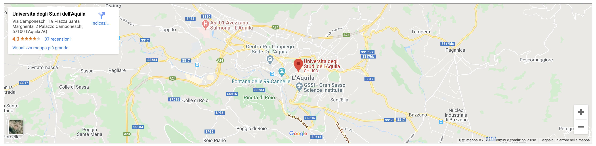
</p>

Below we find all components similar to the one above, but with the number of different columns and the parameters that it takes as input.

- **DIV2COL**

```PHP
function setTwoColumnDiv(string $object1, string $object2)
```
<p align="center">
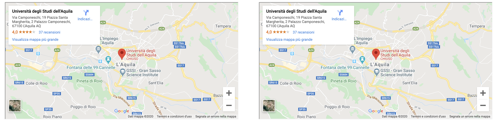
</p>

- **DIV3COL**

```PHP
function setThreeColumnDiv(string $object1, string $object2, string $object3)
```
<p align="center">
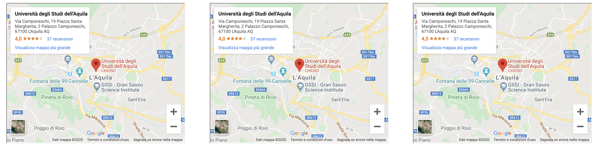
</p>

- **DIV4COL**

```PHP
function setFourColumnDiv(string $object1, string $object2, string $object3, string $object4)
```
<p align="center">
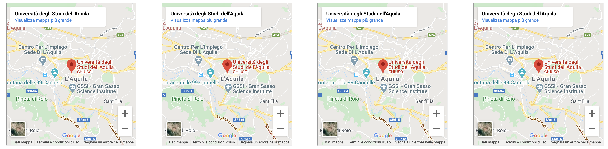
</p>

- **DIV5COL**

```PHP
function setFiveColumnDiv(string $object1, string $object2, string $object3, string $object4, string $object5)
```
<p align="center">
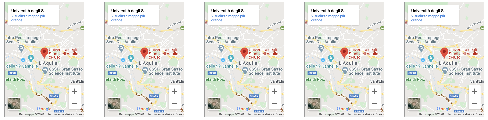
</p>

- **DIV6COL**
```PHP
function setSixColumnDiv(string $object1, string $object2, string $object3, string $object4, string $object5, string $object6)
```
<p align="center">
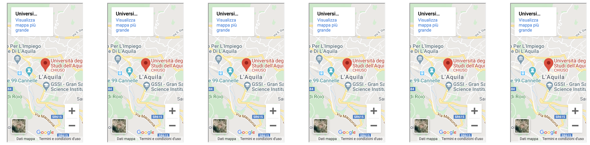
</p>

- **FOOTER**

The Footer component allows you to add a footer to the page.
we created two types of footers:
   - footer it is possible to insert a title, an address, a telephone number, an email, a link to the email, and a         description. It takes as input six string.
   - footer 2 it is possible to insert a various sections with specific links that lead to the page. It takes as input five array of string.

```PHP
function setFooter(string $title, string $completeAddress, string $phoneNumber, string $email, string $mailLink, string $description)
```
<p align="center">

</p>

```PHP
function insert_footer(array $arrayButton, array $arrayButton1, array $arrayButton2, array $arrayButton3, array $arrayButton4)
```
<p align="center">

</p>
  
- **GENERAL FORM**

General form it is a generic form, mainly used to send messages, ask for information or things like that. It takes as input the action of the form.
```PHP
function createGeneralForm(string $attributes)
```
<p align="center">
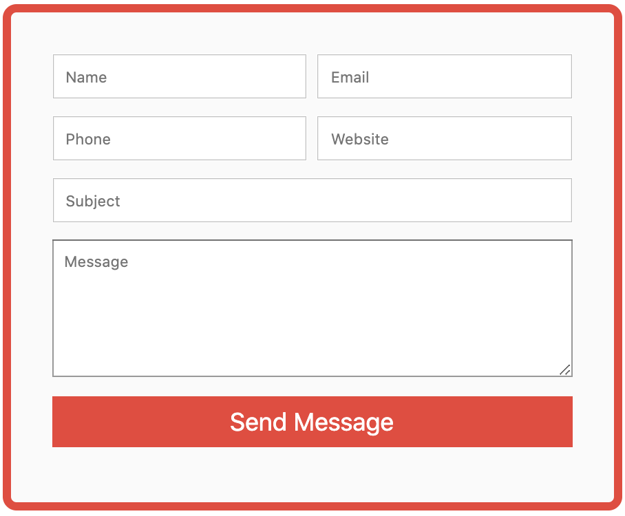
</p>

- **HEADER MENU'**

Header Menu allows you to insert a menu inside the header. Inside the header we can insert all the menu items that we want through an array that we pass to it as input, together with a title, together with a url, and a search action.
```PHP
function showHeaderMenu(array $arrayButton, string $pageTitle, string $homeURL, string $actionSearch)
```
<p align="center">

</p>

- **LIST**

The List component allows you to insert a list within our web application that accepts parameters of any type (string, number, link, etc.). as input it takes an array which can contain elements of any type.
```PHP
function setListElement(array $elements)
```
<p align="center">
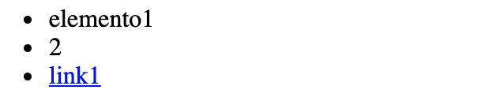
</p>

- **LOGIN FORM**

The Login Form component provide a simple input form, where the user insert username and password. In input takes the attributes that is an action, where the login insert the input of the user.
```PHP
function login(string $attributes)
```
<p align="center">
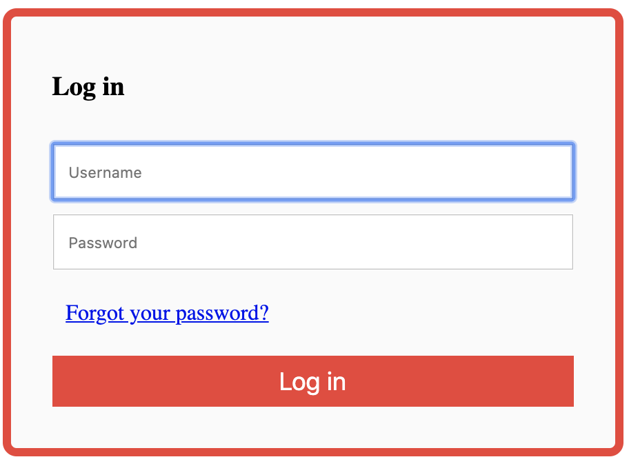
</p>

- **MAP**

The Map component  provide a map, where the user set a location and see where the city is located. This component provide two methos, both take in input a location, but the first allows you to set the city on the map, the second allows you to view the map.
```PHP
function setMap(string $location)
```
```PHP
function printMap($location)
```
<p align="center">

</p>

- **PAYMENT FORM**

The Payment form provide a classic form to checkout an order, where the user insert its data(name, surname, date of the birth ecc.). Takes in input the attributes action.
```PHP
function inset_payment_form()
```
<p align="center">
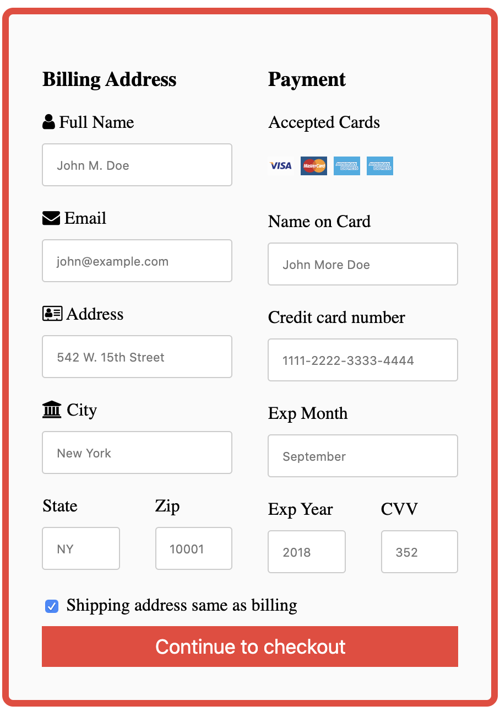
</p>

- **PROFILE CARD**

The Profile Card allows you to set a complete user profile, taking as input parameters six string that allow you to set the data to be displayed within the profile.
```PHP
 function createProfile(string $name, string $role, string $where, string $btnName, string $btnURL, string $img)
```
<p align="center">
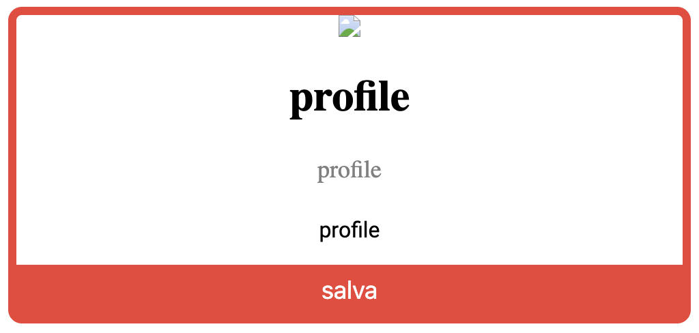
</p>

- **RECEIPE CARD**

The Receipe Card allows the possibility to insert on the web application a receipe for a typical meal, the ingredients that compose it, the difficult for its preparation and the preparation time. All elements are take in input string by the function showReceipeCard.
```PHP
function showRecipeCard(string $recipeName, string $time, string $serving, string $difficult, string $description, string $btnName, string $btnURL, string $imgURL)
```
<p align="center">

</p>

- **REGISTRATION FORM**

The Registration Form allows the possibility to insert a form on the web application to register. It is composed of the classic fields of a registration form. like the other forms it takes as input only the action parameter of the form
```PHP
function createRegistrationForm(string $attributes)
```
<p align="center">
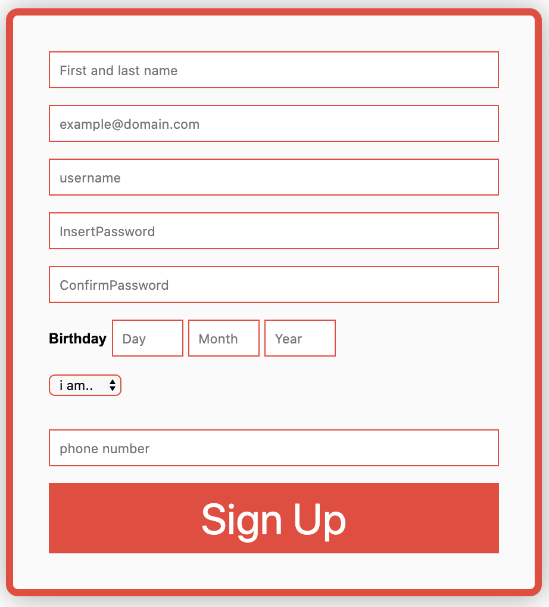
</p>

- **SECTION**

The Section allows the possibility to insert a section on the web application. The parameter that it takes in input are two string the title and the body. 
```PHP
function insertSection(string $title, string $body)
```
<p align="center">
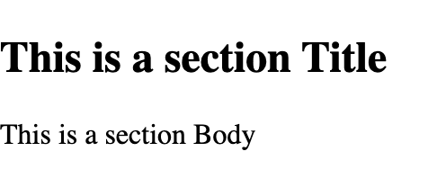
</p>

- **SELECT**

The Select allows the possibility to insert on the web application a selection of something, such as the choice of language. 
```PHP
function printSelectByOptionsArray(array $elements, string $attributes=null)
```
<p align="center">
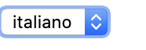
</p>

To insert the options into the select, we can use this method to be inserted into the main php file. first of all we create the single options, then we insert these options inside an array, and then we pass them as a parameter inside the function printSelect();

```PHP
$option1 = new Basic_components();
$option1 = $option1->setOption("italiano", "it");

$option2 = new Basic_components();
$option2 = $option2->setOption("inglese", "en");

$option3 = new Basic_components();
$option3 = $option3->setOption("cinese", "cn");

$optionArray = [$option1,$option2,$option3];

$select = new Basic_components();
$select->printSelect($optionArray);
```
<p align="center">

</p>

- **TABLE**

The Table is a component that allows the possibility to insert on the web application a classic table with rows and columns. Take in input two array one for the columns and one for the rows.
'''PHP
function setTable(array $columns,array $rows)
'''
<p align="center">
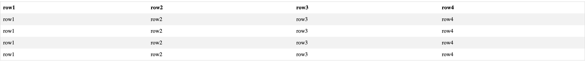
</p>

- **IMG_SLIDER**

The Img_Slider allow the possibility to insert a slider on the web application. It take in input an array of images, which will be inserted into the slider. 
```PHP
function insertSlider(array $images)
```
<p align="center">

</p>

- **BASIC_COMPONENT**

The basic components are all those basic components that can be used by the user. For example a list, a title, a select etc.
Php MasterTemplate contains a set and print method for each of these components.
